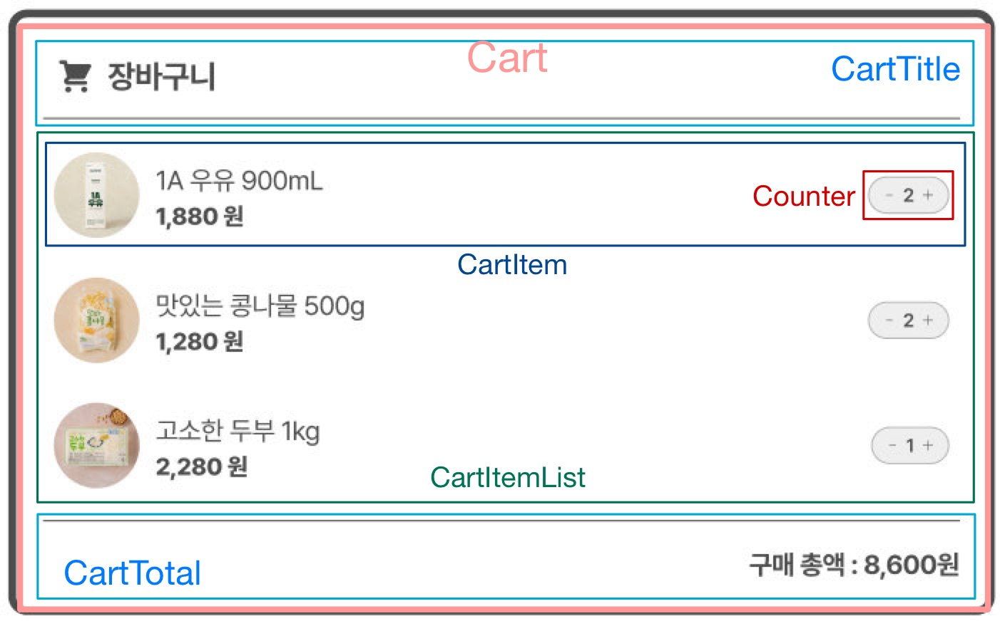

# 장바구니 과제

## 목차

1. [과제 설명](#과제-설명)
1. [결과 화면](#결과-화면)
1. [결론 및 문제점](#결론-및-문제점)

 

## 과제 설명

### 컴포넌트 분리

다음과 같이 컴포넌트를 분리하였다.

컴포넌트 목록은 파스칼케이스로 작성하였지만 파일명은 강의시간에 진행한 것과 동일하게 케밥케이스를 사용했다.

- Cart
  - CartTitle
  - CartItemList
    - CartItem
      - Counter
  - CartTotal

### 데이터 & 상태 관리

상품 데이터를 `constants.ts` 파일에 상수 형태로 분리했다.

> 데이터 항목
- `id`
- `name`: 상품명
- `price`: 상품 가격
- `stock`: 상품 재고 (최대 수량 - 임의로 설정)
- `quantity`: 담은 수량 (기본값은 최소 수량인 1로 설정)

> 상태 관리
- Cart
  - `cartItems` 배열을 CartItemList에 전달
  - `totalPrice` 값을 CartTotal에 전달
  - 하위 컴포넌트에 의해 `updateQuantity`가 갱신되면 `cartItems` 업데이트
- CartItemList
  - Cart로부터 전달받은 `cartItems` 배열의 각 아이템을 cartItem에 전달
  - CartItem으로부터 `updateQuantity` 갱신 정보를 받아 Cart에 전달
- CartItem
  - CartItemList로부터 전달받은 `cartItems` 배열의 각 아이템 정보를 렌더링
  - Counter가 `onChange`를 호출하면 `updateQuantity`를 호출
- Counter
  - 담은 수량(`quantity`)이 변경되면 `onChange` 호출
- CartTotal
  - Cart로부터 전달받은 `totalPrice`를 렌더링

 

## 결과 화면

 

## 결론 및 문제점

### 컴포넌트 분리

이번 과제는 피그마 시안의 컴포넌트를 참고해서 분리했다.

바닐라 프로젝트 때도 마찬가지였지만 컴포넌트 분리를 어떤 기준으로 해야하는지 ~~아직도~~ 감이 잘 오지 않는다. 시각적으로 분리하는 것도 고려해야 하는 건지 아니면 재사용만을 생각해야 하는 건지 잘 모르겠다.

### 상태 관리

이번 과제에서 가장 큰 문제점이었다.

상품 데이터를 Cart 컴포넌트에서 하위 컴포넌트들로 넘겨줬는데 사실 처음에 잘 모르겠어서 지피티의 도움을 조금 받았다. 😭

### 마크업 및 스타일링

데이터와 상태를 어떻게 관리할까 고민하다가 마크업을 소홀히 해버렸다. 시맨틱하지 않고 접근성도 고려하지 못했다.

스타일링은 가장 최근 강의 시간에 사용한 Tailwind를 써보았는데 익숙치 않다보니 키워드를 하나하나 찾아보는 과정이 까다로웠다.

### 😔

과제를 조금 급하게 하느라 세세하게 신경쓰지 못한 부분들이 많다. 야무쌤의 해설 강의를 들으며 놓친 점들을 얼른 메꾸고 싶다.

비교적 간단해보였던 장바구니를 구현하는 과정에서도 props를 전달하는 코드가 복잡하다고 느꼈는데 얼마 남지 않은 프로젝트에서 과연 react를 잘 사용할 수 있을지 두렵다.